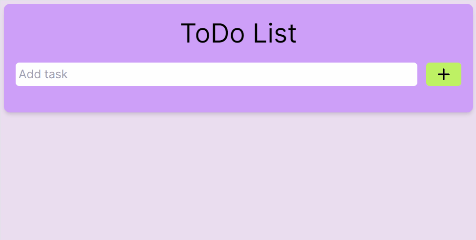

# ToDo List ✅ 
A ToDo List application built with [React.js](https://react.dev/), where users can add, edit, and delete tasks. 

## Features 💡
- **Add Task**: Users can add tasks to the list by typing in the input field and pressing Enter or clicking the "Add" button.

- **Edit Task**: Users can edit existing tasks by clicking the pencil icon. This will transform the task into an editable input field, allowing users to modify the task text. 

- **Delete Task**: Users can delete tasks from the list by clicking the delete icon.

## Technologies ⚙️

## Overview 💻

 